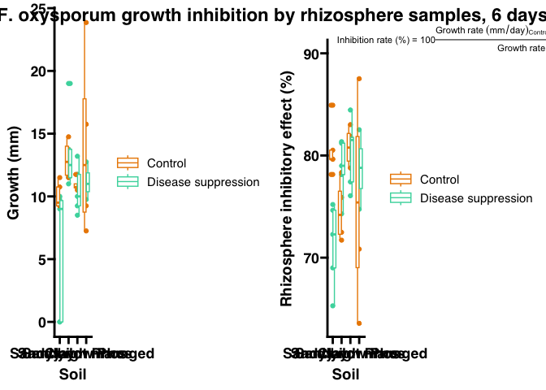
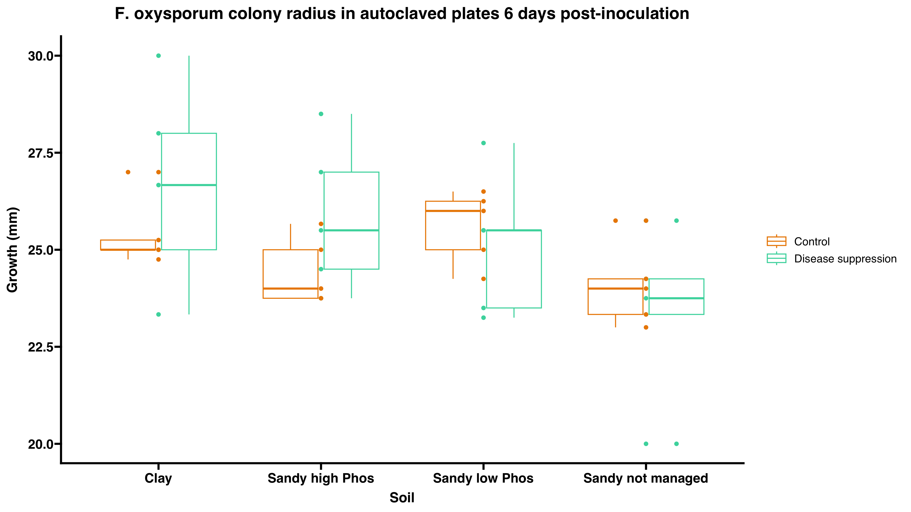
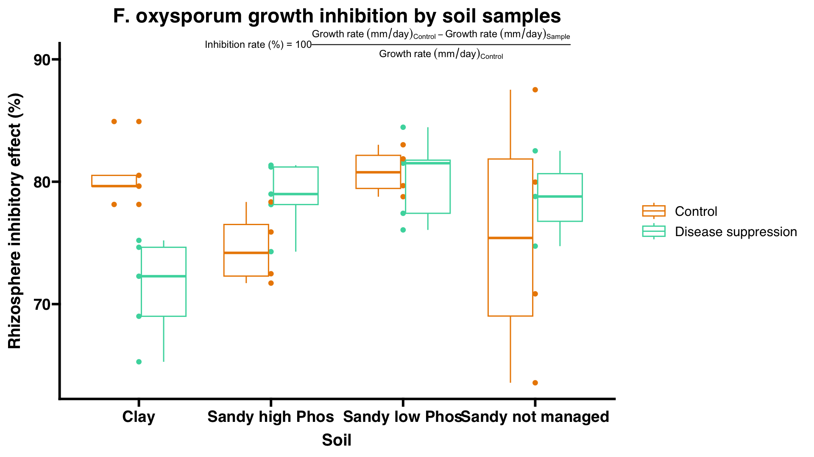
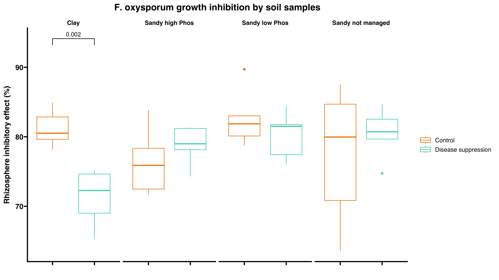

Microresp pipeline
================
David Rodrigo Cajas
2026-02-25

- [0) Data import](#0-data-import)
  - [0.1) Working directory and
    packages](#01-working-directory-and-packages)
  - [0.2) Import measurements data](#02-import-measurements-data)
  - [0.3) Import samples metadata](#03-import-samples-metadata)
- [1) Data processing](#1-data-processing)
- [2) Data visualization](#2-data-visualization)
- [3) Statistics](#3-statistics)
  - [3.1) Fit a model to the data](#31-fit-a-model-to-the-data)
  - [3.2) Run multiple comparisons
    test](#32-run-multiple-comparisons-test)
  - [3.3) Add statistics to the original
    plot](#33-add-statistics-to-the-original-plot)

## 0) Data import

### 0.1) Working directory and packages

First we need to install the Rstudioapi package

``` r
# (Install and) load Rstudio api package
if ("rstudioapi" %in% installed.packages()) {
  library(rstudioapi)
} else {
  install.packages("rstudioapi")
  library(rstudioapi)
} 
```

Now we will set the working directory to where the R markdown folder is

``` r
wd <- dirname(rstudioapi::getSourceEditorContext()$path)

setwd(wd)
```

Import the list of packages in “required_packages.rds” and install them

``` r
# Load list of required packages
required_packages <- readRDS("required_packages.rds")
# Install script's required packages
need_install <- required_packages[!(required_packages) %in% installed.packages()]
if (length(need_install) > 0) {
  install.packages(need_install)
}
```

\[Later on\] If you modified this code, don’t forget to update the list
of script’s required packages

``` r
# required_packages <- names(sessionInfo()$otherPkgs)
# saveRDS(required_packages, "required_packages.rds")
```

### 0.2) Import measurements data

Import the first page inside the “pathogen_growth_inhibition.xlsx” excel
file.

``` r
library(readxl)
library(dplyr)
```

    ## 
    ## Attaching package: 'dplyr'

    ## The following objects are masked from 'package:stats':
    ## 
    ##     filter, lag

    ## The following objects are masked from 'package:base':
    ## 
    ##     intersect, setdiff, setequal, union

``` r
library(stringr)
library(gtools)
library(tidyverse)
```

    ## ── Attaching core tidyverse packages ──────────────────────── tidyverse 2.0.0 ──
    ## ✔ forcats   1.0.0     ✔ readr     2.1.5
    ## ✔ ggplot2   3.5.2     ✔ tibble    3.3.0
    ## ✔ lubridate 1.9.4     ✔ tidyr     1.3.1
    ## ✔ purrr     1.0.4

    ## ── Conflicts ────────────────────────────────────────── tidyverse_conflicts() ──
    ## ✖ dplyr::filter() masks stats::filter()
    ## ✖ dplyr::lag()    masks stats::lag()
    ## ℹ Use the conflicted package (<http://conflicted.r-lib.org/>) to force all conflicts to become errors

``` r
# set the file containing the data
sourcefile <- "pathogen_growth_inhibition.xlsx"

results <- read_excel(sourcefile, sheet = 1) # import columns
results <- drop_na(results,"Sample") # Remove rows where the Sample value is NA

# Set the right type for every column
results$Week <- as.factor(results$Week)
results$Sample <- as.factor(results$Sample)
results$Agrobacterium_colonies_5dpi_B_relative_growth <- as.factor(results$Agrobacterium_colonies_5dpi_B_relative_growth)

# See the dataframe
(results)
```

    ## # A tibble: 44 × 16
    ##    Week  Inoculation_date    Sample              Fusarium_growth_6dpi_A_steril…¹
    ##    <fct> <dttm>              <fct>                                         <dbl>
    ##  1 1     2025-05-22 00:00:00 Postitive_control_1                            28.7
    ##  2 1     2025-05-22 00:00:00 1                                              23.3
    ##  3 1     2025-05-22 00:00:00 2                                              30  
    ##  4 1     2025-05-22 00:00:00 3                                              26.7
    ##  5 1     2025-05-22 00:00:00 4                                              25  
    ##  6 1     2025-05-22 00:00:00 5                                              28  
    ##  7 2     2025-05-28 00:00:00 Postitive_control_2                            NA  
    ##  8 2     2025-05-28 00:00:00 6                                              25  
    ##  9 2     2025-05-28 00:00:00 11                                             25.5
    ## 10 2     2025-05-28 00:00:00 12                                             27  
    ## # ℹ 34 more rows
    ## # ℹ abbreviated name: ¹​Fusarium_growth_6dpi_A_sterile_mm
    ## # ℹ 12 more variables: Fusarium_growth_6dpi_B_mm <dbl>,
    ## #   Fusarium_growth_11dpi_A_sterile_mm <dbl>, Fusarium_growth_11dpi_B_mm <dbl>,
    ## #   Fusarium_growth_14dpi_B_mm <dbl>,
    ## #   `Agrobacterium_colonies_5dpi_A_sterile_#` <dbl>,
    ## #   Agrobacterium_dilution_A_sterile <dbl>, …

### 0.3) Import samples metadata

#### 0.3.1) Import metadata from samples

``` r
library(readxl)
library(stringr)
library(tidyr)

# Import sample labels from Metadata page in "pathogen_growth_inhibition.xlsx" spreadsheet
meta <- read_excel(sourcefile, sheet = "Metadata") # import columns
meta$Sample <- as.factor(meta$Sample) # Make sure the Sample column is of type character
meta$replicate <- as.factor(meta$replicate)

meta
```

    ## # A tibble: 40 × 7
    ##    Sample plant soil  treatment replicate moisture weight_for_0.5
    ##    <fct>  <chr> <chr> <chr>     <fct>        <dbl>          <dbl>
    ##  1 1      Bare  Cl    Cp        1             6.67          0.536
    ##  2 2      Bare  Cl    Cp        2             8.79          0.548
    ##  3 3      Bare  Cl    Cp        3             7.12          0.538
    ##  4 4      Bare  Cl    Cp        4             8.81          0.548
    ##  5 5      Bare  Cl    Cp        5             7.85          0.543
    ##  6 6      Bare  Cl    Ct        1             6.49          0.535
    ##  7 7      Bare  Cl    Ct        2             5.95          0.532
    ##  8 8      Bare  Cl    Ct        3             4.11          0.521
    ##  9 9      Bare  Cl    Ct        4             7.24          0.539
    ## 10 10     Bare  Cl    Ct        5             9.09          0.550
    ## # ℹ 30 more rows

#### 0.3.2) Import experiment metadata

Note that this script imports the metadata from
“experiment_metadata.xlsx” assuming that it’s separated by sheets called
“treatment_data”, “soil_data” and “plant_data”. The order is not
relevant.

``` r
library(readxl)

# Define source of experiment metadata

sourcemeta <- "experiment_metadata.xlsx"

for (i in excel_sheets(sourcemeta)) {
  # Import data
  
  df <- read_excel(sourcemeta, sheet = i) # import all experiment metadata in separated dataframes per sheet
  
  # Wrap up
  
  assign(i, df) # name output dataframe
  rm(df,i) # remove auxiliary "df" and "i" objects
}

# Add order to treatments
treatment_data$label <- factor(as.factor(treatment_data$label), levels = c("Control", "Disease suppression", "AMF", "Nitrogen fixation", "Phosphate solubilisation"))
treatment_data$applied_product <- factor(as.factor(treatment_data$applied_product), levels = c("No product", "Compete Plus", "MycorGran 2.0", "Vixeran", "NuelloPhos"))

# Small processing of soil data

numeric_cols <- names(soil_data)[sapply(soil_data, function(x) any(grepl("[0-9]", x)))] # Auxiliary object listing the columns that contain numbers
soil_data[numeric_cols] <- lapply(soil_data[numeric_cols], function(x) {
  x <- ifelse(grepl("^<", x), 0, x) # Identify values beginning with "<", which are below detection limitm and replace them with 0
  x <- as.numeric(x)  # Convert to numeric AFTER cleaning
  x
}) # This function replaces values that start with "<" with 0
rm(numeric_cols) # Remove auxiliary object
```

#### 0.3.3) Extract relevant experiment metadata and merge it into our metadata spreadsheet

``` r
library(dplyr)

# Define relevant metadata to extract. This can be modified for further customisation
pick_metadata <- c(colnames(soil_data[,c(3,6,10:14)]), # chosen metadata columns in soil_data
                   colnames(treatment_data[,c(3,5:14)]), # chosen metadata columns in treatment_data
                   colnames(plant_data[,c()])) # chosen metadata columns in plant_data

# Create a function to replace values in a common column. It will be used to replace labels
replace_values <- function(df1, df2, col_name, new_col_name) {
  df1 %>%
    left_join(df2, by = col_name) %>%  # Join with lookup table
    mutate(!!col_name := !!sym(new_col_name)) %>% # Replace original values with labels
    select(-!!sym(new_col_name)) # Delete the new_col_name column can now be deleted
} # replaces the values of the col_name column in the df1 for the values of the new_col_name in the df2, assuming col_name exist in both dataframes

# Add selected metadata and change labels to metadata dataframe

  meta <- meta %>%
    
    # Add defined metadata
    
    left_join(select(plant_data, "plant",any_of(pick_metadata)), by = "plant") %>%
    left_join(select(soil_data, "soil",any_of(pick_metadata)), by = "soil") %>%
    left_join(select(treatment_data, "treatment",any_of(pick_metadata)), by = "treatment") %>%
    
    # Replace compressed labels for full size variables
    
    replace_values(plant_data[,1:2], "plant", "label") %>%
    replace_values(soil_data[,1:2], "soil", "label") %>%
    replace_values(treatment_data[,1:2], "treatment", "label")

meta
```

    ## # A tibble: 40 × 25
    ##    Sample plant     soil  treatment           replicate moisture weight_for_0.5
    ##    <fct>  <chr>     <chr> <fct>               <fct>        <dbl>          <dbl>
    ##  1 1      Bare soil Clay  Disease suppression 1             6.67          0.536
    ##  2 2      Bare soil Clay  Disease suppression 2             8.79          0.548
    ##  3 3      Bare soil Clay  Disease suppression 3             7.12          0.538
    ##  4 4      Bare soil Clay  Disease suppression 4             8.81          0.548
    ##  5 5      Bare soil Clay  Disease suppression 5             7.85          0.543
    ##  6 6      Bare soil Clay  Control             1             6.49          0.535
    ##  7 7      Bare soil Clay  Control             2             5.95          0.532
    ##  8 8      Bare soil Clay  Control             3             4.11          0.521
    ##  9 9      Bare soil Clay  Control             4             7.24          0.539
    ## 10 10     Bare soil Clay  Control             5             9.09          0.550
    ## # ℹ 30 more rows
    ## # ℹ 18 more variables: origin_location <chr>, soil_texture_main <chr>,
    ## #   clay_perc <dbl>, CaCO3_perc <dbl>, NOM_perc <dbl>, pH <dbl>,
    ## #   `P-CaCl2_mgP/kg` <dbl>, applied_product <fct>, target_function <chr>,
    ## #   active_principle_1 <chr>, active_principle_2 <chr>,
    ## #   active_principle_3 <chr>, active_principle_4 <chr>,
    ## #   active_principle_5 <chr>, active_principle_6 <chr>, …

#### 0.3.4) Paste metadata dataframe from 0.3.3) into Results dataframe imported in 0.2)

``` r
library(dplyr)

results <- left_join(results,meta,by = "Sample")
results
```

    ## # A tibble: 44 × 40
    ##    Week  Inoculation_date    Sample              Fusarium_growth_6dpi_A_steril…¹
    ##    <fct> <dttm>              <fct>                                         <dbl>
    ##  1 1     2025-05-22 00:00:00 Postitive_control_1                            28.7
    ##  2 1     2025-05-22 00:00:00 1                                              23.3
    ##  3 1     2025-05-22 00:00:00 2                                              30  
    ##  4 1     2025-05-22 00:00:00 3                                              26.7
    ##  5 1     2025-05-22 00:00:00 4                                              25  
    ##  6 1     2025-05-22 00:00:00 5                                              28  
    ##  7 2     2025-05-28 00:00:00 Postitive_control_2                            NA  
    ##  8 2     2025-05-28 00:00:00 6                                              25  
    ##  9 2     2025-05-28 00:00:00 11                                             25.5
    ## 10 2     2025-05-28 00:00:00 12                                             27  
    ## # ℹ 34 more rows
    ## # ℹ abbreviated name: ¹​Fusarium_growth_6dpi_A_sterile_mm
    ## # ℹ 36 more variables: Fusarium_growth_6dpi_B_mm <dbl>,
    ## #   Fusarium_growth_11dpi_A_sterile_mm <dbl>, Fusarium_growth_11dpi_B_mm <dbl>,
    ## #   Fusarium_growth_14dpi_B_mm <dbl>,
    ## #   `Agrobacterium_colonies_5dpi_A_sterile_#` <dbl>,
    ## #   Agrobacterium_dilution_A_sterile <dbl>, …

## 1) Data processing

Some calculations will be done to further process the data:

- Fungal growth rate:
  $Growth~rate~(mm/day) = \frac{colony~radius~(mm)}{time~(days)}$

- Inhibition rate (based on [Sarven MS et
  al. 2020](https://www.mdpi.com/2076-0817/9/3/213). doi
  10.3390/pathogens9030213):
  $Inhibition~rate~(\%) = \frac{Growth~rate~(mm/day)_{Sterile} - Growth~rate~(mm/day)_{Sample}}{Growth~rate~(mm/day)_{Sterile}} \times 100$

``` r
# Calculate growth rates
results$Fusarium_growth_rate_A_sterile_mmday <- (results$Fusarium_growth_6dpi_A_sterile_mm/6)

results$Fusarium_growth_rate_B_mmday <- (results$Fusarium_growth_14dpi_B_mm/14) # taking the 14 dpi data as a measurement point

# Calculate inhibition growth rates

results$Fusarium_inhibition_rate <- (100*(results$Fusarium_growth_rate_A_sterile_mmday - results$Fusarium_growth_rate_B_mmday) /  results$Fusarium_growth_rate_A_sterile_mmday)
```

Let’s check a simplified view of the dataset

``` r
interest_columns <- c("Sample", "soil", "treatment", "Fusarium_growth_14dpi_B_mm", "Fusarium_inhibition_rate")
select(results, interest_columns)
```

    ## Warning: Using an external vector in selections was deprecated in tidyselect 1.1.0.
    ## ℹ Please use `all_of()` or `any_of()` instead.
    ##   # Was:
    ##   data %>% select(interest_columns)
    ## 
    ##   # Now:
    ##   data %>% select(all_of(interest_columns))
    ## 
    ## See <https://tidyselect.r-lib.org/reference/faq-external-vector.html>.
    ## This warning is displayed once every 8 hours.
    ## Call `lifecycle::last_lifecycle_warnings()` to see where this warning was
    ## generated.

    ## # A tibble: 44 × 5
    ##    Sample          soil  treatment Fusarium_growth_14dp…¹ Fusarium_inhibition_…²
    ##    <fct>           <chr> <fct>                      <dbl>                  <dbl>
    ##  1 Postitive_cont… <NA>  <NA>                        NA                     NA  
    ##  2 1               Clay  Disease …                   13.5                   75.2
    ##  3 2               Clay  Disease …                   17.8                   74.6
    ##  4 3               Clay  Disease …                   17.2                   72.3
    ##  5 4               Clay  Disease …                   20.2                   65.3
    ##  6 5               Clay  Disease …                   20.2                   69.0
    ##  7 Postitive_cont… <NA>  <NA>                        NA                     NA  
    ##  8 6               Clay  Control                     12.8                   78.1
    ##  9 11              Sand… Disease …                   12.5                   79.0
    ## 10 12              Sand… Disease …                   11.8                   81.3
    ## # ℹ 34 more rows
    ## # ℹ abbreviated names: ¹​Fusarium_growth_14dpi_B_mm, ²​Fusarium_inhibition_rate

## 2) Data visualization

Just for visual consistency. A standard color palette

``` r
# 5 color palette 
palette_5col <- c("#EB8900", "#47D7AC", "#FAD847", "#2761C4", "#962C5D", "#CC4389")
# palette_5col <- c("#EB8900", "#2761C4", "#47D7AC", "#CC4389", "#FAD847")

# Treatment palettes based on the 5 color palette
palette_treatments <- palette_5col
names(palette_treatments) <- levels(treatment_data$label)

palette_products <- palette_5col
names(palette_products) <- levels(treatment_data$applied_product)
```

Plot both the raw measurements along with the inhibition rate indicator

``` r
library(ggplot2)
library(ggpubr)
library(ggprism)
library(plotly)
```

    ## 
    ## Attaching package: 'plotly'

    ## The following object is masked from 'package:ggplot2':
    ## 
    ##     last_plot

    ## The following object is masked from 'package:stats':
    ## 
    ##     filter

    ## The following object is masked from 'package:graphics':
    ## 
    ##     layout

``` r
plot_fusarium_growth_sterile <- ggplot(drop_na(drop_na(results,"treatment"),"Fusarium_growth_6dpi_A_sterile_mm")
       , aes(x = soil, y = Fusarium_growth_6dpi_A_sterile_mm, color = treatment)) +
  geom_point() +
  geom_boxplot() +
  scale_color_manual(values = palette_treatments) +
  theme_prism() + 
  labs(x = "Soil", y = "Growth (mm)") +
  ggtitle("F. oxysporum colony radius in autoclaved plates 6 days post-inoculation")

plot_fusarium_growth_sample <- ggplot(drop_na(results,"Fusarium_growth_14dpi_B_mm")
       , aes(x = soil, y = Fusarium_growth_14dpi_B_mm, color = treatment)) +
  geom_point() +
  geom_boxplot() +
  scale_color_manual(values = palette_treatments) +
  theme_prism() + 
  labs(x = "Soil", y = "Growth (mm)") +
  ggtitle("F. oxysporum colony radius in non-autoclaved plates 14 days post-inoculation")

plot_fusarium_inhibition <- ggplot(drop_na(results,"Fusarium_inhibition_rate")
       , aes(x = soil, y = Fusarium_inhibition_rate, color = treatment)) +
  geom_point() +
  geom_boxplot() +
  scale_color_manual(values = palette_treatments) +
  theme_prism() + 
  annotate("text",
           x = 1.5, # Midpoint of the x-axis, adjust if you have more soil types
           y = 90, # Place it slightly above the max data point. Adjust this value.
           label = expression(paste("Inhibition rate (%) = ", 100 * frac(Growth~rate~(mm/day)[Sterile] - Growth~rate~(mm/day)[Sample], Growth~rate~(mm/day)[Sterile]))),
           hjust = 0, # Center horizontally
           vjust = 0,   # Align the top of the text with the y-coordinate
           size = 3) +
  coord_cartesian(clip = "off") + # Allows text to go outside the standard plot area
  labs(x = "Soil", y = "Rhizosphere inhibitory effect (%)") + ggtitle("F. oxysporum growth inhibition by soil samples")

ggarrange(plot_fusarium_growth_sterile,plot_fusarium_growth_sample, nrow = 1, common.legend = T)
```

<!-- -->

``` r
plot_fusarium_growth_sterile
```

<!-- -->

``` r
plot_fusarium_growth_sample
```

<!-- -->

``` r
plot_fusarium_inhibition
```

    ## Warning in is.na(x): is.na() applied to non-(list or vector) of type
    ## 'expression'

<!-- -->

## 3) Statistics

### 3.1) Fit a model to the data

Finding de model that best describes the data:

``` r
library(lme4)
```

    ## Loading required package: Matrix

    ## 
    ## Attaching package: 'Matrix'

    ## The following objects are masked from 'package:tidyr':
    ## 
    ##     expand, pack, unpack

``` r
library(nlme)
```

    ## 
    ## Attaching package: 'nlme'

    ## The following object is masked from 'package:lme4':
    ## 
    ##     lmList

    ## The following object is masked from 'package:dplyr':
    ## 
    ##     collapse

``` r
library(lmerTest)
```

    ## 
    ## Attaching package: 'lmerTest'

    ## The following object is masked from 'package:lme4':
    ## 
    ##     lmer

    ## The following object is masked from 'package:stats':
    ## 
    ##     step

``` r
library(pbkrtest)

# Using lmer() function

model_random_a <- lmer(Fusarium_inhibition_rate ~ soil + treatment + soil:treatment + (1|replicate), data = drop_na(results,"Fusarium_growth_rate_B_mmday")) # Mixed model with soil, treatment and their interaction as fixed effect, plus a random replicate effect


model_nest_a <- lmer(Fusarium_inhibition_rate ~ soil + treatment + soil:treatment + (1|treatment:replicate), data = drop_na(results,"Fusarium_growth_rate_B_mmday")) # Same as before, but the replicate effect is nested inside the treatment.

# Using lme() function

model_random_b <- lme(Fusarium_inhibition_rate ~ soil + treatment + soil:treatment, random = ~ 1|replicate, data = drop_na(results,"Fusarium_growth_rate_B_mmday")) # Mixed model with soil, treatment and their interaction as fixed effect, plus a random replicate effect

model_nest_b <- lme(Fusarium_inhibition_rate ~ soil + treatment + soil:treatment, random = ~ 1|soil/replicate, data = drop_na(results,"Fusarium_growth_rate_B_mmday")) # Same as before, but the replicate effect is nested inside the treatment.

# Using lm() function

model_fixed_a <- lm(Fusarium_inhibition_rate ~ soil/replicate + soil + treatment + soil:treatment, data = drop_na(results,"Fusarium_growth_rate_B_mmday")) # Linear model with soil, treatment, their interaction and the replicate effect all defined as fixed factors.

model_fixed_b <- lm(Fusarium_inhibition_rate ~ soil + treatment + soil:treatment, data = drop_na(results,"Fusarium_growth_rate_B_mmday")) # Linear model with soil, treatment and their interactions as fixed factors, disregarding replicate effect entirely.


### The mixed models with no nesting of the replicate effect were more successful on fitting the data, therefore explain better the dataset and will be used in further analyses.

summary(model_random_a)
```

    ## Linear mixed model fit by REML. t-tests use Satterthwaite's method [
    ## lmerModLmerTest]
    ## Formula: Fusarium_inhibition_rate ~ soil + treatment + soil:treatment +  
    ##     (1 | replicate)
    ##    Data: drop_na(results, "Fusarium_growth_rate_B_mmday")
    ## 
    ## REML criterion at convergence: 205.7
    ## 
    ## Scaled residuals: 
    ##      Min       1Q   Median       3Q      Max 
    ## -2.50400 -0.50477 -0.01913  0.48058  2.07612 
    ## 
    ## Random effects:
    ##  Groups    Name        Variance Std.Dev.
    ##  replicate (Intercept)  2.741   1.656   
    ##  Residual              22.227   4.715   
    ## Number of obs: 40, groups:  replicate, 5
    ## 
    ## Fixed effects:
    ##                                                    Estimate Std. Error     df
    ## (Intercept)                                          81.214      2.235 29.511
    ## soilSandy high Phos                                  -4.756      2.982 28.000
    ## soilSandy low Phos                                    1.484      2.982 28.000
    ## soilSandy not managed                                -3.896      2.982 28.000
    ## treatmentDisease suppression                         -9.932      2.982 28.000
    ## soilSandy high Phos:treatmentDisease suppression     12.266      4.217 28.000
    ## soilSandy low Phos:treatmentDisease suppression       7.475      4.217 28.000
    ## soilSandy not managed:treatmentDisease suppression   13.082      4.217 28.000
    ##                                                    t value Pr(>|t|)    
    ## (Intercept)                                         36.344  < 2e-16 ***
    ## soilSandy high Phos                                 -1.595  0.12194    
    ## soilSandy low Phos                                   0.498  0.62248    
    ## soilSandy not managed                               -1.307  0.20194    
    ## treatmentDisease suppression                        -3.331  0.00244 ** 
    ## soilSandy high Phos:treatmentDisease suppression     2.909  0.00703 ** 
    ## soilSandy low Phos:treatmentDisease suppression      1.773  0.08718 .  
    ## soilSandy not managed:treatmentDisease suppression   3.102  0.00435 ** 
    ## ---
    ## Signif. codes:  0 '***' 0.001 '**' 0.01 '*' 0.05 '.' 0.1 ' ' 1
    ## 
    ## Correlation of Fixed Effects:
    ##             (Intr) slSnhP slSnlP slSnnm trtmDs sShP:s sSlP:s
    ## slSndyhghPh -0.667                                          
    ## slSndylwPhs -0.667  0.500                                   
    ## slSndyntmng -0.667  0.500  0.500                            
    ## trtmntDsssp -0.667  0.500  0.500  0.500                     
    ## slShPhs:tDs  0.472 -0.707 -0.354 -0.354 -0.707              
    ## slSlPhs:tDs  0.472 -0.354 -0.707 -0.354 -0.707  0.500       
    ## slSnmngd:Ds  0.472 -0.354 -0.354 -0.707 -0.707  0.500  0.500

``` r
# summary(model_random_b)
# summary(model_fixed_a)
# summary(model_fixed_b)

anova(model_random_a)
```

    ## Type III Analysis of Variance Table with Satterthwaite's method
    ##                 Sum Sq Mean Sq NumDF DenDF F value  Pr(>F)  
    ## soil           147.974  49.325     3    28  2.2192 0.10798  
    ## treatment       29.786  29.786     1    28  1.3401 0.25680  
    ## soil:treatment 270.333  90.111     3    28  4.0542 0.01638 *
    ## ---
    ## Signif. codes:  0 '***' 0.001 '**' 0.01 '*' 0.05 '.' 0.1 ' ' 1

``` r
# anova.lme(model_random_b)
# anova(model_fixed_a)
# anova(model_fixed_b)
```

The mixed linear model suggests there is are inconsistent soil effects
and treatment effects. The ANOVA does not find significant soil or
treatment effect but it does show a significant soil:treatment
interaction. The comparison will be carried then in an interaction
cohort basis, ie: treatment difference within soils.

### 3.2) Run multiple comparisons test

``` r
library(emmeans)
```

    ## Welcome to emmeans.
    ## Caution: You lose important information if you filter this package's results.
    ## See '? untidy'

``` r
# library(multcomp)
library(dplyr)

# Get estimated marginal means for the 'group' factor
paircomp <- emmeans(model_random_a, pairwise ~ treatment|soil, adjust = "tukey")
# (paircomp <- emmeans(model_random_a, pairwise ~ treatment|soil_texture_main, adjust = "tukey"))

significant <- as.data.frame(paircomp$contrasts)[as.data.frame(paircomp$contrasts)$p.value < 0.1, ]
significant <- separate(significant, contrast, into = c("treatment1", "treatment2"), sep = " - ")

significant
```

    ##   treatment1          treatment2 soil estimate       SE df t.ratio     p.value
    ## 1    Control Disease suppression Clay 9.931565 2.981727 28 3.33081 0.002440228

According to the multiple comparisons analysis, the only soil where the
treatment produces a significant change is in the Clay soil. The
additional sample measurement for the Sandy high Phosphate soil might
change the result for this comparison.

### 3.3) Add statistics to the original plot

``` r
significant <- significant %>%
  group_by(soil) %>%
  mutate(y_position = max(as.data.frame(paircomp)$upper.CL) * 1.05 + 
                        (row_number() - 1) * max(as.data.frame(paircomp)$upper.CL) * 0.1) %>%
  ungroup()
```

    ## Warning: There were 2 warnings in `mutate()`.
    ## The first warning was:
    ## ℹ In argument: `y_position = +...`.
    ## ℹ In group 1: `soil = Clay`.
    ## Caused by warning in `as.data.frame.emm_list()`:
    ## ! Note: 'as.data.frame' has combined your 2 sets of results into one object,
    ## and this affects things like adjusted P values. Refer to the annotations.
    ## ℹ Run `dplyr::last_dplyr_warnings()` to see the 1 remaining warning.

``` r
ggplot(drop_na(results,"Fusarium_inhibition_rate")
       , aes(x = treatment, y = Fusarium_inhibition_rate, color = treatment)) +
  facet_wrap(~soil, nrow = 1) +
  geom_boxplot() +
  scale_color_manual(values = palette_treatments) +
  theme_prism() +
  coord_cartesian(clip = "off") + # Allows text to go outside the standard plot area
  theme(axis.text.x = element_blank()) + 
  labs(x = "", y = "Rhizosphere inhibitory effect (%)") + ggtitle("F. oxysporum growth inhibition by soil samples") + 
  geom_signif(
  data = significant,
  aes(xmin = treatment1, xmax = treatment2, annotations = round(p.value, 3),
  y_position = y_position), # Position the annotations
  manual = TRUE,
  inherit.aes = FALSE
)
```

    ## Warning in geom_signif(data = significant, aes(xmin = treatment1, xmax =
    ## treatment2, : Ignoring unknown aesthetics: xmin, xmax, annotations, and
    ## y_position

<!-- -->
