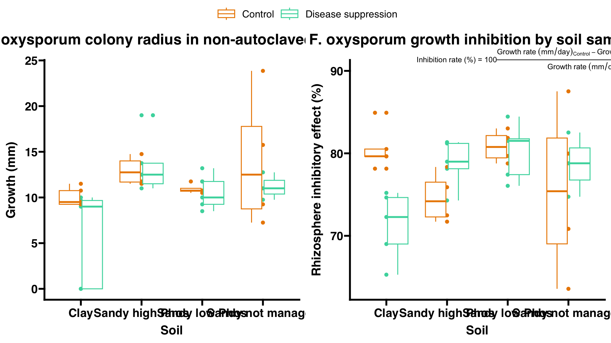

Microresp pipeline
================
David Rodrigo Cajas
2025-06-19

- [0) Data import](#0-data-import)
  - [0.1) Working directory and
    packages](#01-working-directory-and-packages)
  - [0.2) Create dataframe](#02-create-dataframe)
  - [0.3) Import samples metadata](#03-import-samples-metadata)
- [1) Data processing](#1-data-processing)
- [2) Data visualization](#2-data-visualization)
- [4) Statistics](#4-statistics)

## 0) Data import

### 0.1) Working directory and packages

First we need to install the Rstudioapi package

``` r
# (Install and) load Rstudio api package
if ("rstudioapi" %in% installed.packages()) {
  library(rstudioapi)
} else {
  install.packages("rstudioapi")
  library(rstudioapi)
} 
```

Now we will set the working directory to where the R markdown folder is

``` r
wd <- dirname(rstudioapi::getSourceEditorContext()$path)

setwd(wd)
```

Import the list of packages in “required_packages.rds” and install them

``` r
# Load list of required packages
required_packages <- readRDS("required_packages.rds")
# Install script's required packages
need_install <- required_packages[!(required_packages) %in% installed.packages()]
if (length(need_install) > 0) {
  install.packages(need_install)
}
```

\[Later on\] If you modified this code, don’t forget to update the list
of script’s required packages

``` r
# required_packages <- names(sessionInfo()$otherPkgs)
# saveRDS(required_packages, "required_packages.rds")
```

### 0.2) Create dataframe

#### 0.2.1) Import measurements data

Import all pages inside the “pathogen_growth_inhibition.xlsx” excel
file.

``` r
library(readxl)
library(dplyr)
```

    ## 
    ## Attaching package: 'dplyr'

    ## The following objects are masked from 'package:stats':
    ## 
    ##     filter, lag

    ## The following objects are masked from 'package:base':
    ## 
    ##     intersect, setdiff, setequal, union

``` r
library(stringr)
library(gtools)
library(tidyverse)
```

    ## ── Attaching core tidyverse packages ──────────────────────── tidyverse 2.0.0 ──
    ## ✔ forcats   1.0.0     ✔ readr     2.1.5
    ## ✔ ggplot2   3.5.2     ✔ tibble    3.3.0
    ## ✔ lubridate 1.9.4     ✔ tidyr     1.3.1
    ## ✔ purrr     1.0.4

    ## ── Conflicts ────────────────────────────────────────── tidyverse_conflicts() ──
    ## ✖ dplyr::filter() masks stats::filter()
    ## ✖ dplyr::lag()    masks stats::lag()
    ## ℹ Use the conflicted package (<http://conflicted.r-lib.org/>) to force all conflicts to become errors

``` r
# set the file containing the data
sourcefile <- "pathogen_growth_inhibition.xlsx"

results <- read_excel(sourcefile, sheet = 1) # import columns
results <- drop_na(results,"Sample") # Remove rows where the Sample value is NA

# Set the right type for every column
results$Week <- as.factor(results$Week)
results$Sample <- as.factor(results$Sample)
results$Agrobacterium_colonies_5dpi_B_relative_growth <- as.factor(results$Agrobacterium_colonies_5dpi_B_relative_growth)

# See the dataframe
(results)
```

    ## # A tibble: 44 × 16
    ##    Week  Inoculation_date    Sample              Fusarium_growth_6dpi_A_steril…¹
    ##    <fct> <dttm>              <fct>                                         <dbl>
    ##  1 1     2025-05-22 00:00:00 Postitive_control_1                            28.7
    ##  2 1     2025-05-22 00:00:00 1                                              23.3
    ##  3 1     2025-05-22 00:00:00 2                                              30  
    ##  4 1     2025-05-22 00:00:00 3                                              26.7
    ##  5 1     2025-05-22 00:00:00 4                                              25  
    ##  6 1     2025-05-22 00:00:00 5                                              28  
    ##  7 2     2025-05-28 00:00:00 Postitive_control_2                            NA  
    ##  8 2     2025-05-28 00:00:00 6                                              25  
    ##  9 2     2025-05-28 00:00:00 11                                             25.5
    ## 10 2     2025-05-28 00:00:00 12                                             27  
    ## # ℹ 34 more rows
    ## # ℹ abbreviated name: ¹​Fusarium_growth_6dpi_A_sterile_mm
    ## # ℹ 12 more variables: Fusarium_growth_6dpi_B_mm <dbl>,
    ## #   Fusarium_growth_11dpi_A_sterile_mm <dbl>, Fusarium_growth_11dpi_B_mm <dbl>,
    ## #   Fusarium_growth_14dpi_B_mm <dbl>,
    ## #   `Agrobacterium_colonies_5dpi_A_sterile_#` <dbl>,
    ## #   Agrobacterium_dilution_A_sterile <dbl>, …

#### 0.2.2) Data processing

Some calculations will be done:

Fungal growth rate:
$Growth~rate~(mm/day) = \frac{colony~radius~(mm)}{time~(days)}$

Inhibition rate (based on [Kamaruzzaman et
al. 2021](https://www.sciencedirect.com/science/article/pii/S1878535221003051)):
$Inhibition~rate~(\%) = \frac{Growth~rate~(mm/day)_{Control} - Growth~rate~(mm/day)_{Sample}}{Growth~rate~(mm/day)_{Control}} \times 100$

Area-based inhibition rate:
$Inhibition~rate~(\%) = \frac{\pi \times Area_{Control} - \pi \times Area_{Sample}}{\pi \times Area_{Control}} \times 100$

$$
= \frac{\pi \times (Growth~rate~(mm/day)_{Control})^2 - \pi \times (Growth~rate~(mm/day)_{Sample})^2}{\pi \times (Growth~rate~(mm/day)_{Control})^2} \times 100
$$

$$
= \frac{(Growth~rate~(mm/day)_{Control} - Growth~rate~(mm/day)_{Sample})^2}{(Growth~rate~(mm/day)_{Control})^2} \times 100
$$

``` r
# Calculate growth rates
results$Fusarium_growth_rate_A_sterile_mmday <- (results$Fusarium_growth_6dpi_A_sterile_mm/6)

results$Fusarium_growth_rate_B_mmday <- (results$Fusarium_growth_14dpi_B_mm/14)

# Calculate inhibition growth rates

results$Fusarium_inhibition_rate <- (100*(results$Fusarium_growth_rate_A_sterile_mmday - results$Fusarium_growth_rate_B_mmday) /  results$Fusarium_growth_rate_A_sterile_mmday)

results$Fusarium_inhibition_area <- (100*(results$Fusarium_growth_rate_A_sterile_mmday - results$Fusarium_growth_rate_B_mmday)^2 /  results$Fusarium_growth_rate_A_sterile_mmday^2)
```

### 0.3) Import samples metadata

#### 0.3.1) Import metadata from samples processed in Microresp

``` r
library(readxl)
library(stringr)
library(tidyr)

#Import sample labels from Microresp spreadsheet
meta <- read_excel(sourcefile, sheet = "Metadata") # import columns
meta$Sample <- as.factor(meta$Sample) # Make sure the Sample column is of type character
meta$replicate <- as.factor(meta$replicate)

meta
```

    ## # A tibble: 40 × 7
    ##    Sample plant soil  treatment replicate moisture weight_for_0.5
    ##    <fct>  <chr> <chr> <chr>     <fct>        <dbl>          <dbl>
    ##  1 1      Bare  Cl    Cp        1             6.67          0.536
    ##  2 2      Bare  Cl    Cp        2             8.79          0.548
    ##  3 3      Bare  Cl    Cp        3             7.12          0.538
    ##  4 4      Bare  Cl    Cp        4             8.81          0.548
    ##  5 5      Bare  Cl    Cp        5             7.85          0.543
    ##  6 6      Bare  Cl    Ct        1             6.49          0.535
    ##  7 7      Bare  Cl    Ct        2             5.95          0.532
    ##  8 8      Bare  Cl    Ct        3             4.11          0.521
    ##  9 9      Bare  Cl    Ct        4             7.24          0.539
    ## 10 10     Bare  Cl    Ct        5             9.09          0.550
    ## # ℹ 30 more rows

#### 0.3.2) Import experiment metadata

Note that this script imports the metadata from
“experiment_metadata.xlsx” assuming that it’s separated by sheets called
“treatment_data”, “soil_data” and “plant_data”. The order is not
relevant.

``` r
library(readxl)

# Define source of experiment metadata

sourcemeta <- "experiment_metadata.xlsx"

for (i in excel_sheets(sourcemeta)) {
  # Import data
  
  df <- read_excel(sourcemeta, sheet = i) # import all experiment metadata in separated dataframes per sheet
  
  # Wrap up
  
  assign(i, df) # name output dataframe
  rm(df,i) # remove auxiliary "df" and "i" objects
}

# Add order to treatments
treatment_data$label <- factor(as.factor(treatment_data$label), levels = c("Control", "Disease suppression", "AMF", "Nitrogen fixation", "Phosphate solubilisation"))
treatment_data$applied_product <- factor(as.factor(treatment_data$applied_product), levels = c("No product", "Compete Plus", "MycorGran 2.0", "Vixeran", "NuelloPhos"))

# Small processing of soil data

numeric_cols <- names(soil_data)[sapply(soil_data, function(x) any(grepl("[0-9]", x)))] # Auxiliary object listing the columns that contain numbers
soil_data[numeric_cols] <- lapply(soil_data[numeric_cols], function(x) {
  x <- ifelse(grepl("^<", x), 0, x) # Identify values beginning with "<", which are below detection limitm and replace them with 0
  x <- as.numeric(x)  # Convert to numeric AFTER cleaning
  x
}) # This function replaces values that start with "<" with 0
rm(numeric_cols) # Remove auxiliary object
```

#### 0.3.3) Extract relevant experiment metadata and add to Microresp metadata dataframes

``` r
library(dplyr)

# Define relevant metadata to extract. This can be modified for further customisation
pick_metadata <- c(colnames(soil_data[,c(3,6,10:14)]), # chosen metadata columns in soil_data
                   colnames(treatment_data[,c(3,5:14)]), # chosen metadata columns in treatment_data
                   colnames(plant_data[,c()])) # chosen metadata columns in plant_data

# Create a function to replace values in a common column. It will be used to replace labels
replace_values <- function(df1, df2, col_name, new_col_name) {
  df1 %>%
    left_join(df2, by = col_name) %>%  # Join with lookup table
    mutate(!!col_name := !!sym(new_col_name)) %>% # Replace original values with labels
    select(-!!sym(new_col_name)) # Delete the new_col_name column can now be deleted
} # replaces the values of the col_name column in the df1 for the values of the new_col_name in the df2, assuming col_name exist in both dataframes

# Add selected metadata and change labels to metadata dataframe

  meta <- meta %>%
    
    # Add defined metadata
    
    left_join(select(plant_data, "plant",any_of(pick_metadata)), by = "plant") %>%
    left_join(select(soil_data, "soil",any_of(pick_metadata)), by = "soil") %>%
    left_join(select(treatment_data, "treatment",any_of(pick_metadata)), by = "treatment") %>%
    
    # Replace compressed labels for full size variables
    
    replace_values(plant_data[,1:2], "plant", "label") %>%
    replace_values(soil_data[,1:2], "soil", "label") %>%
    replace_values(treatment_data[,1:2], "treatment", "label")

meta
```

    ## # A tibble: 40 × 25
    ##    Sample plant     soil  treatment           replicate moisture weight_for_0.5
    ##    <fct>  <chr>     <chr> <fct>               <fct>        <dbl>          <dbl>
    ##  1 1      Bare soil Clay  Disease suppression 1             6.67          0.536
    ##  2 2      Bare soil Clay  Disease suppression 2             8.79          0.548
    ##  3 3      Bare soil Clay  Disease suppression 3             7.12          0.538
    ##  4 4      Bare soil Clay  Disease suppression 4             8.81          0.548
    ##  5 5      Bare soil Clay  Disease suppression 5             7.85          0.543
    ##  6 6      Bare soil Clay  Control             1             6.49          0.535
    ##  7 7      Bare soil Clay  Control             2             5.95          0.532
    ##  8 8      Bare soil Clay  Control             3             4.11          0.521
    ##  9 9      Bare soil Clay  Control             4             7.24          0.539
    ## 10 10     Bare soil Clay  Control             5             9.09          0.550
    ## # ℹ 30 more rows
    ## # ℹ 18 more variables: origin_location <chr>, soil_texture <chr>,
    ## #   CaCO3_perc <dbl>, NOM_perc <dbl>, pH <dbl>, `P-CaCl2_mgP/kg` <dbl>,
    ## #   `P-AL_mgP/kg` <dbl>, applied_product <fct>, target_function <chr>,
    ## #   active_principle_1 <chr>, active_principle_2 <chr>,
    ## #   active_principle_3 <chr>, active_principle_4 <chr>,
    ## #   active_principle_5 <chr>, active_principle_6 <chr>, …

#### 0.3.4) Paste metadata dataframe from 0.3.3) into Results dataframe imported in 0.2)

``` r
library(dplyr)

results <- left_join(results,meta,by = "Sample")
results
```

    ## # A tibble: 44 × 44
    ##    Week  Inoculation_date    Sample              Fusarium_growth_6dpi_A_steril…¹
    ##    <fct> <dttm>              <fct>                                         <dbl>
    ##  1 1     2025-05-22 00:00:00 Postitive_control_1                            28.7
    ##  2 1     2025-05-22 00:00:00 1                                              23.3
    ##  3 1     2025-05-22 00:00:00 2                                              30  
    ##  4 1     2025-05-22 00:00:00 3                                              26.7
    ##  5 1     2025-05-22 00:00:00 4                                              25  
    ##  6 1     2025-05-22 00:00:00 5                                              28  
    ##  7 2     2025-05-28 00:00:00 Postitive_control_2                            NA  
    ##  8 2     2025-05-28 00:00:00 6                                              25  
    ##  9 2     2025-05-28 00:00:00 11                                             25.5
    ## 10 2     2025-05-28 00:00:00 12                                             27  
    ## # ℹ 34 more rows
    ## # ℹ abbreviated name: ¹​Fusarium_growth_6dpi_A_sterile_mm
    ## # ℹ 40 more variables: Fusarium_growth_6dpi_B_mm <dbl>,
    ## #   Fusarium_growth_11dpi_A_sterile_mm <dbl>, Fusarium_growth_11dpi_B_mm <dbl>,
    ## #   Fusarium_growth_14dpi_B_mm <dbl>,
    ## #   `Agrobacterium_colonies_5dpi_A_sterile_#` <dbl>,
    ## #   Agrobacterium_dilution_A_sterile <dbl>, …

``` r
colnames(results)
```

    ##  [1] "Week"                                          
    ##  [2] "Inoculation_date"                              
    ##  [3] "Sample"                                        
    ##  [4] "Fusarium_growth_6dpi_A_sterile_mm"             
    ##  [5] "Fusarium_growth_6dpi_B_mm"                     
    ##  [6] "Fusarium_growth_11dpi_A_sterile_mm"            
    ##  [7] "Fusarium_growth_11dpi_B_mm"                    
    ##  [8] "Fusarium_growth_14dpi_B_mm"                    
    ##  [9] "Agrobacterium_colonies_5dpi_A_sterile_#"       
    ## [10] "Agrobacterium_dilution_A_sterile"              
    ## [11] "Agrobacterium_population_5dpi_A_sterile_CFU-mL"
    ## [12] "Agrobacterium_colonies_5dpi_B_#"               
    ## [13] "Agrobacterium_dilution_B"                      
    ## [14] "Agrobacterium_population_5dpi_B_CFU-mL"        
    ## [15] "Agrobacterium_colonies_5dpi_B_relative_growth" 
    ## [16] "Agrobacterium_lowest_dilution_with_growth_B"   
    ## [17] "Fusarium_growth_rate_A_sterile_mmday"          
    ## [18] "Fusarium_growth_rate_B_mmday"                  
    ## [19] "Fusarium_inhibition_rate"                      
    ## [20] "Fusarium_inhibition_area"                      
    ## [21] "plant"                                         
    ## [22] "soil"                                          
    ## [23] "treatment"                                     
    ## [24] "replicate"                                     
    ## [25] "moisture"                                      
    ## [26] "weight_for_0.5"                                
    ## [27] "origin_location"                               
    ## [28] "soil_texture"                                  
    ## [29] "CaCO3_perc"                                    
    ## [30] "NOM_perc"                                      
    ## [31] "pH"                                            
    ## [32] "P-CaCl2_mgP/kg"                                
    ## [33] "P-AL_mgP/kg"                                   
    ## [34] "applied_product"                               
    ## [35] "target_function"                               
    ## [36] "active_principle_1"                            
    ## [37] "active_principle_2"                            
    ## [38] "active_principle_3"                            
    ## [39] "active_principle_4"                            
    ## [40] "active_principle_5"                            
    ## [41] "active_principle_6"                            
    ## [42] "active_principle_7"                            
    ## [43] "active_principle_8"                            
    ## [44] "active_principle_9"

Simplified view of the dataset

``` r
interest_columns <- c("Sample", "soil", "treatment", "Fusarium_growth_14dpi_B_mm", "Fusarium_inhibition_rate", "Fusarium_inhibition_area")
select(results, interest_columns)
```

    ## Warning: Using an external vector in selections was deprecated in tidyselect 1.1.0.
    ## ℹ Please use `all_of()` or `any_of()` instead.
    ##   # Was:
    ##   data %>% select(interest_columns)
    ## 
    ##   # Now:
    ##   data %>% select(all_of(interest_columns))
    ## 
    ## See <https://tidyselect.r-lib.org/reference/faq-external-vector.html>.
    ## This warning is displayed once every 8 hours.
    ## Call `lifecycle::last_lifecycle_warnings()` to see where this warning was
    ## generated.

    ## # A tibble: 44 × 6
    ##    Sample          soil  treatment Fusarium_growth_14dp…¹ Fusarium_inhibition_…²
    ##    <fct>           <chr> <fct>                      <dbl>                  <dbl>
    ##  1 Postitive_cont… <NA>  <NA>                        NA                     NA  
    ##  2 1               Clay  Disease …                   13.5                   75.2
    ##  3 2               Clay  Disease …                   17.8                   74.6
    ##  4 3               Clay  Disease …                   17.2                   72.3
    ##  5 4               Clay  Disease …                   20.2                   65.3
    ##  6 5               Clay  Disease …                   20.2                   69.0
    ##  7 Postitive_cont… <NA>  <NA>                        NA                     NA  
    ##  8 6               Clay  Control                     12.8                   78.1
    ##  9 11              Sand… Disease …                   12.5                   79.0
    ## 10 12              Sand… Disease …                   11.8                   81.3
    ## # ℹ 34 more rows
    ## # ℹ abbreviated names: ¹​Fusarium_growth_14dpi_B_mm, ²​Fusarium_inhibition_rate
    ## # ℹ 1 more variable: Fusarium_inhibition_area <dbl>

## 1) Data processing

## 2) Data visualization

Just for visual consistency. A standard color palette

``` r
# 5 color palette 
palette_5col <- c("#EB8900", "#47D7AC", "#FAD847", "#2761C4", "#962C5D", "#CC4389")
# palette_5col <- c("#EB8900", "#2761C4", "#47D7AC", "#CC4389", "#FAD847")

# Treatment palettes based on the 5 color palette
palette_treatments <- palette_5col
names(palette_treatments) <- levels(treatment_data$label)

palette_products <- palette_5col
names(palette_products) <- levels(treatment_data$applied_product)
```

``` r
library(ggplot2)
library(ggpubr)
library(ggprism)
library(plotly)
```

    ## 
    ## Attaching package: 'plotly'

    ## The following object is masked from 'package:ggplot2':
    ## 
    ##     last_plot

    ## The following object is masked from 'package:stats':
    ## 
    ##     filter

    ## The following object is masked from 'package:graphics':
    ## 
    ##     layout

``` r
plot_fusarium_growth <- ggplot(drop_na(results,"Fusarium_growth_14dpi_B_mm")
       , aes(x = soil, y = Fusarium_growth_6dpi_B_mm, color = treatment)) +
  geom_point() +
  geom_boxplot() +
  scale_color_manual(values = palette_treatments) +
  theme_prism() + 
  labs(x = "Soil", y = "Growth (mm)") 

plot_fusarium_inhibition <- ggplot(drop_na(results,"Fusarium_inhibition_rate")
       , aes(x = soil, y = Fusarium_inhibition_rate, color = treatment)) +
  geom_point() +
  geom_boxplot() +
  scale_color_manual(values = palette_treatments) +
  theme_prism() + 
  annotate("text",
           x = 1.5, # Midpoint of the x-axis, adjust if you have more soil types
           y = 90, # Place it slightly above the max data point. Adjust this value.
           label = expression(paste("Inhibition rate (%) = ", 100 * frac(Growth~rate~(mm/day)[Control] - Growth~rate~(mm/day)[Sample], Growth~rate~(mm/day)[Control]))),
           hjust = 0, # Center horizontally
           vjust = 0,   # Align the top of the text with the y-coordinate
           size = 3) +
  coord_cartesian(clip = "off") + # Allows text to go outside the standard plot area
  labs(x = "Soil", y = "Rhizosphere inhibitory effect (%)") + ggtitle("F. oxysporum growth inhibition by rhizosphere samples, 6 days after inoculation")

plot_fusarium_inhibition_2 <- ggplot(drop_na(results,"Fusarium_inhibition_area")
       , aes(x = soil, y = Fusarium_inhibition_area, color = treatment)) +
  geom_point() +
  geom_boxplot() +
  scale_color_manual(values = palette_treatments) +
    annotate("text",
           x = 1.5, # Midpoint of the x-axis, adjust if you have more soil types
           y = 90, # Place it slightly above the max data point. Adjust this value.
           label = expression(paste("Inhibition rate (%) = ", 100 * frac((Growth~rate~(mm/day)[Control] - Growth~rate~(mm/day)[Sample])^2, (Growth~rate~(mm/day)[Control])^2))),
           hjust = 0, # Center horizontally
           vjust = 0,   # Align the top of the text with the y-coordinate
           size = 3) +
  coord_cartesian(clip = "off") + # Allows text to go outside the standard plot area
  theme_prism() + 
  labs(x = "Soil", y = "Rhizosphere inhibitory area (%)") 

ggarrange(plot_fusarium_growth,plot_fusarium_inhibition, nrow = 1)
```

    ## Warning in is.na(x): is.na() applied to non-(list or vector) of type
    ## 'expression'

<!-- -->

``` r
ggplotly(plot_fusarium_growth)
```

    ## PhantomJS not found. You can install it with webshot::install_phantomjs(). If it is installed, please make sure the phantomjs executable can be found via the PATH variable.

<div class="plotly html-widget html-fill-item" id="htmlwidget-c9f42221745e637c5e7d" style="width:672px;height:480px;"></div>
<script type="application/json" data-for="htmlwidget-c9f42221745e637c5e7d">{"x":{"data":[{"x":[1,2,2,3,4,1,1,1,1,2,2,3,3,3,4,4,4],"y":[10.75,14.75,13.75,11.75,23.857142857142858,9.25,11.5,9.5,9.25,11.75,11.5,10.5,10.75,10.75,15.75,9.25,7.25],"text":["soil: Clay<br />Fusarium_growth_6dpi_B_mm: 10.750000<br />treatment: Control","soil: Sandy high Phos<br />Fusarium_growth_6dpi_B_mm: 14.750000<br />treatment: Control","soil: Sandy high Phos<br />Fusarium_growth_6dpi_B_mm: 13.750000<br />treatment: Control","soil: Sandy low Phos<br />Fusarium_growth_6dpi_B_mm: 11.750000<br />treatment: Control","soil: Sandy not managed<br />Fusarium_growth_6dpi_B_mm: 23.857143<br />treatment: Control","soil: Clay<br />Fusarium_growth_6dpi_B_mm:  9.250000<br />treatment: Control","soil: Clay<br />Fusarium_growth_6dpi_B_mm: 11.500000<br />treatment: Control","soil: Clay<br />Fusarium_growth_6dpi_B_mm:  9.500000<br />treatment: Control","soil: Clay<br />Fusarium_growth_6dpi_B_mm:  9.250000<br />treatment: Control","soil: Sandy high Phos<br />Fusarium_growth_6dpi_B_mm: 11.750000<br />treatment: Control","soil: Sandy high Phos<br />Fusarium_growth_6dpi_B_mm: 11.500000<br />treatment: Control","soil: Sandy low Phos<br />Fusarium_growth_6dpi_B_mm: 10.500000<br />treatment: Control","soil: Sandy low Phos<br />Fusarium_growth_6dpi_B_mm: 10.750000<br />treatment: Control","soil: Sandy low Phos<br />Fusarium_growth_6dpi_B_mm: 10.750000<br />treatment: Control","soil: Sandy not managed<br />Fusarium_growth_6dpi_B_mm: 15.750000<br />treatment: Control","soil: Sandy not managed<br />Fusarium_growth_6dpi_B_mm:  9.250000<br />treatment: Control","soil: Sandy not managed<br />Fusarium_growth_6dpi_B_mm:  7.250000<br />treatment: Control"],"type":"scatter","mode":"markers","marker":{"autocolorscale":false,"color":"rgba(235,137,0,1)","opacity":1,"size":5.6692913385826778,"symbol":"circle","line":{"width":1.8897637795275593,"color":"rgba(235,137,0,1)"}},"hoveron":"points","name":"Control","legendgroup":"Control","showlegend":true,"xaxis":"x","yaxis":"y","hoverinfo":"text","frame":null},{"x":[1,1,1,1,1,2,2,3,3,4,2,2,2,3,3,3,4,4],"y":[10,9.6666666666666661,9,0,0,19,11,13.199999999999999,10,12.75,12.5,13.75,11.5,9.25,11.75,8.5,9.75,11],"text":["soil: Clay<br />Fusarium_growth_6dpi_B_mm: 10.000000<br />treatment: Disease suppression","soil: Clay<br />Fusarium_growth_6dpi_B_mm:  9.666667<br />treatment: Disease suppression","soil: Clay<br />Fusarium_growth_6dpi_B_mm:  9.000000<br />treatment: Disease suppression","soil: Clay<br />Fusarium_growth_6dpi_B_mm:  0.000000<br />treatment: Disease suppression","soil: Clay<br />Fusarium_growth_6dpi_B_mm:  0.000000<br />treatment: Disease suppression","soil: Sandy high Phos<br />Fusarium_growth_6dpi_B_mm: 19.000000<br />treatment: Disease suppression","soil: Sandy high Phos<br />Fusarium_growth_6dpi_B_mm: 11.000000<br />treatment: Disease suppression","soil: Sandy low Phos<br />Fusarium_growth_6dpi_B_mm: 13.200000<br />treatment: Disease suppression","soil: Sandy low Phos<br />Fusarium_growth_6dpi_B_mm: 10.000000<br />treatment: Disease suppression","soil: Sandy not managed<br />Fusarium_growth_6dpi_B_mm: 12.750000<br />treatment: Disease suppression","soil: Sandy high Phos<br />Fusarium_growth_6dpi_B_mm: 12.500000<br />treatment: Disease suppression","soil: Sandy high Phos<br />Fusarium_growth_6dpi_B_mm: 13.750000<br />treatment: Disease suppression","soil: Sandy high Phos<br />Fusarium_growth_6dpi_B_mm: 11.500000<br />treatment: Disease suppression","soil: Sandy low Phos<br />Fusarium_growth_6dpi_B_mm:  9.250000<br />treatment: Disease suppression","soil: Sandy low Phos<br />Fusarium_growth_6dpi_B_mm: 11.750000<br />treatment: Disease suppression","soil: Sandy low Phos<br />Fusarium_growth_6dpi_B_mm:  8.500000<br />treatment: Disease suppression","soil: Sandy not managed<br />Fusarium_growth_6dpi_B_mm:  9.750000<br />treatment: Disease suppression","soil: Sandy not managed<br />Fusarium_growth_6dpi_B_mm: 11.000000<br />treatment: Disease suppression"],"type":"scatter","mode":"markers","marker":{"autocolorscale":false,"color":"rgba(71,215,172,1)","opacity":1,"size":5.6692913385826778,"symbol":"circle","line":{"width":1.8897637795275593,"color":"rgba(71,215,172,1)"}},"hoveron":"points","name":"Disease suppression","legendgroup":"Disease suppression","showlegend":true,"xaxis":"x","yaxis":"y","hoverinfo":"text","frame":null},{"x":[1,1,1,1,1,2,2,2,2,3,3,3,3,4,4,4,4],"y":[10.75,9.25,9.25,11.5,9.5,11.75,14.75,13.75,11.5,11.75,10.75,10.5,10.75,23.857142857142858,15.75,9.25,7.25],"hoverinfo":"y","type":"box","fillcolor":"rgba(255,255,255,1)","marker":{"opacity":null,"outliercolor":"rgba(0,0,0,1)","line":{"width":1.8897637795275593,"color":"rgba(0,0,0,1)"},"size":5.6692913385826778},"line":{"color":"rgba(235,137,0,1)","width":1.8897637795275593},"name":"Control","legendgroup":"Control","showlegend":false,"xaxis":"x","yaxis":"y","frame":null},{"x":[1,1,1,1,1,2,2,2,2,2,3,3,3,3,3,4,4,4],"y":[10,9.6666666666666661,9,0,0,19,11,13.75,11.5,12.5,13.199999999999999,9.25,11.75,8.5,10,9.75,12.75,11],"hoverinfo":"y","type":"box","fillcolor":"rgba(255,255,255,1)","marker":{"opacity":null,"outliercolor":"rgba(0,0,0,1)","line":{"width":1.8897637795275593,"color":"rgba(0,0,0,1)"},"size":5.6692913385826778},"line":{"color":"rgba(71,215,172,1)","width":1.8897637795275593},"name":"Disease suppression","legendgroup":"Disease suppression","showlegend":false,"xaxis":"x","yaxis":"y","frame":null}],"layout":{"margin":{"t":29.017849730178501,"r":9.2984640929846432,"b":56.720630967206304,"l":53.001245330012466},"plot_bgcolor":"transparent","paper_bgcolor":"rgba(255,255,255,1)","font":{"color":"rgba(0,0,0,1)","family":"sans","size":18.596928185969279},"xaxis":{"domain":[0,1],"automargin":true,"type":"linear","autorange":false,"range":[0.40000000000000002,4.5999999999999996],"tickmode":"array","ticktext":["Clay","Sandy high Phos","Sandy low Phos","Sandy not managed"],"tickvals":[1,2,3,4],"categoryorder":"array","categoryarray":["Clay","Sandy high Phos","Sandy low Phos","Sandy not managed"],"nticks":null,"ticks":"outside","tickcolor":"rgba(0,0,0,1)","ticklen":7.4387712743877135,"tickwidth":1.32835201328352,"showticklabels":true,"tickfont":{"color":"rgba(0,0,0,1)","family":"sans","size":17.667081776670816},"tickangle":-0,"showline":true,"linecolor":"rgba(0,0,0,1)","linewidth":1.32835201328352,"showgrid":false,"gridcolor":null,"gridwidth":0,"zeroline":false,"anchor":"y","title":{"text":"<b> Soil <\/b>","font":{"color":"rgba(0,0,0,1)","family":"sans","size":18.596928185969279}},"hoverformat":".2f"},"yaxis":{"domain":[0,1],"automargin":true,"type":"linear","autorange":false,"range":[-1.1928571428571428,25.050000000000001],"tickmode":"array","ticktext":["0","5","10","15","20","25"],"tickvals":[0,5,10,15,20,25],"categoryorder":"array","categoryarray":["0","5","10","15","20","25"],"nticks":null,"ticks":"outside","tickcolor":"rgba(0,0,0,1)","ticklen":7.4387712743877135,"tickwidth":1.32835201328352,"showticklabels":true,"tickfont":{"color":"rgba(0,0,0,1)","family":"sans","size":17.667081776670816},"tickangle":-0,"showline":true,"linecolor":"rgba(0,0,0,1)","linewidth":1.32835201328352,"showgrid":false,"gridcolor":null,"gridwidth":0,"zeroline":false,"anchor":"x","title":{"text":"<b> Growth (mm) <\/b>","font":{"color":"rgba(0,0,0,1)","family":"sans","size":18.596928185969279}},"hoverformat":".2f"},"shapes":[{"type":"rect","fillcolor":null,"line":{"color":null,"width":0,"linetype":[]},"yref":"paper","xref":"paper","x0":0,"x1":1,"y0":0,"y1":1}],"showlegend":true,"legend":{"bgcolor":null,"bordercolor":null,"borderwidth":0,"font":{"color":"rgba(0,0,0,1)","family":"sans","size":14.877542548775427},"title":{"text":"treatment","font":{"color":null,"family":null,"size":0}}},"hovermode":"closest","barmode":"relative"},"config":{"doubleClick":"reset","modeBarButtonsToAdd":["hoverclosest","hovercompare"],"showSendToCloud":false},"source":"A","attrs":{"5e4115eb9788":{"x":{},"y":{},"colour":{},"type":"scatter"},"5e411e296cf6":{"x":{},"y":{},"colour":{}}},"cur_data":"5e4115eb9788","visdat":{"5e4115eb9788":["function (y) ","x"],"5e411e296cf6":["function (y) ","x"]},"highlight":{"on":"plotly_click","persistent":false,"dynamic":false,"selectize":false,"opacityDim":0.20000000000000001,"selected":{"opacity":1},"debounce":0},"shinyEvents":["plotly_hover","plotly_click","plotly_selected","plotly_relayout","plotly_brushed","plotly_brushing","plotly_clickannotation","plotly_doubleclick","plotly_deselect","plotly_afterplot","plotly_sunburstclick"],"base_url":"https://plot.ly"},"evals":[],"jsHooks":[]}</script>

## 4) Statistics

Finding de model that best describes the data:

``` r
library(lme4)
```

    ## Loading required package: Matrix

    ## 
    ## Attaching package: 'Matrix'

    ## The following objects are masked from 'package:tidyr':
    ## 
    ##     expand, pack, unpack

``` r
library(nlme)
```

    ## 
    ## Attaching package: 'nlme'

    ## The following object is masked from 'package:lme4':
    ## 
    ##     lmList

    ## The following object is masked from 'package:dplyr':
    ## 
    ##     collapse

``` r
library(lmerTest)
```

    ## 
    ## Attaching package: 'lmerTest'

    ## The following object is masked from 'package:lme4':
    ## 
    ##     lmer

    ## The following object is masked from 'package:stats':
    ## 
    ##     step

``` r
library(pbkrtest)

# Using lmer() function

model_random_a <- lmer(Fusarium_inhibition_rate ~ soil + treatment + soil:treatment + (1|replicate), data = drop_na(results,"Fusarium_growth_rate_B_mmday")) # Mixed model with soil, treatment and their interaction as fixed effect, plus a random replicate effect


model_nest_a <- lmer(Fusarium_inhibition_rate ~ soil + treatment + soil:treatment + (1|treatment:replicate), data = drop_na(results,"Fusarium_growth_rate_B_mmday")) # Same as before, but the replicate effect is nested inside the treatment.

# Using lme() function

model_random_b <- lme(Fusarium_inhibition_rate ~ soil + treatment + soil:treatment, random = ~ 1|replicate, data = drop_na(results,"Fusarium_growth_rate_B_mmday")) # Mixed model with soil, treatment and their interaction as fixed effect, plus a random replicate effect

model_nest_b <- lme(Fusarium_inhibition_rate ~ soil + treatment + soil:treatment, random = ~ 1|soil/replicate, data = drop_na(results,"Fusarium_growth_rate_B_mmday")) # Same as before, but the replicate effect is nested inside the treatment.

# Using lm() function

model_fixed <- lm(Fusarium_inhibition_rate ~ soil/replicate + soil + treatment + soil:treatment, data = drop_na(results,"Fusarium_growth_rate_B_mmday")) # Linear model with soil, treatment, their interaction and the replicate effect all defined as fixed factors.


### The mixed models with no nesting of the replicate effect were more successful on fitting the data, therefore explain better the dataset and will be used in further analyses.

summary(model_random_a)
```

    ## Linear mixed model fit by REML. t-tests use Satterthwaite's method [
    ## lmerModLmerTest]
    ## Formula: Fusarium_inhibition_rate ~ soil + treatment + soil:treatment +  
    ##     (1 | replicate)
    ##    Data: drop_na(results, "Fusarium_growth_rate_B_mmday")
    ## 
    ## REML criterion at convergence: 170.8
    ## 
    ## Scaled residuals: 
    ##      Min       1Q   Median       3Q      Max 
    ## -2.49142 -0.50916 -0.01755  0.51315  2.64135 
    ## 
    ## Random effects:
    ##  Groups    Name        Variance Std.Dev.
    ##  replicate (Intercept)  0.7317  0.8554  
    ##  Residual              20.5239  4.5303  
    ## Number of obs: 35, groups:  replicate, 5
    ## 
    ## Fixed effects:
    ##                                                    Estimate Std. Error      df
    ## (Intercept)                                         80.5716     2.0618 26.8409
    ## soilSandy high Phos                                 -5.9265     3.0442 24.1958
    ## soilSandy low Phos                                   0.2731     3.0439 24.1411
    ## soilSandy not managed                               -5.0608     3.0442 24.1958
    ## treatmentDisease suppression                        -9.2887     2.8652 23.6216
    ## soilSandy high Phos:treatmentDisease suppression    13.4363     4.1805 23.9301
    ## soilSandy low Phos:treatmentDisease suppression      8.6861     4.1803 23.9003
    ## soilSandy not managed:treatmentDisease suppression  12.6094     4.4979 24.0158
    ##                                                    t value Pr(>|t|)    
    ## (Intercept)                                         39.078  < 2e-16 ***
    ## soilSandy high Phos                                 -1.947  0.06325 .  
    ## soilSandy low Phos                                   0.090  0.92925    
    ## soilSandy not managed                               -1.662  0.10932    
    ## treatmentDisease suppression                        -3.242  0.00352 ** 
    ## soilSandy high Phos:treatmentDisease suppression     3.214  0.00372 ** 
    ## soilSandy low Phos:treatmentDisease suppression      2.078  0.04863 *  
    ## soilSandy not managed:treatmentDisease suppression   2.803  0.00985 ** 
    ## ---
    ## Signif. codes:  0 '***' 0.001 '**' 0.01 '*' 0.05 '.' 0.1 ' ' 1
    ## 
    ## Correlation of Fixed Effects:
    ##             (Intr) slSnhP slSnlP slSnnm trtmDs sShP:s sSlP:s
    ## slSndyhghPh -0.654                                          
    ## slSndylwPhs -0.654  0.442                                   
    ## slSndyntmng -0.654  0.446  0.442                            
    ## trtmntDsssp -0.695  0.471  0.471  0.471                     
    ## slShPhs:tDs  0.476 -0.728 -0.322 -0.325 -0.685              
    ## slSlPhs:tDs  0.476 -0.322 -0.728 -0.322 -0.685  0.469       
    ## slSnmngd:Ds  0.443 -0.300 -0.301 -0.675 -0.637  0.437  0.437

``` r
summary(model_random_b)
```

    ## Linear mixed-effects model fit by REML
    ##   Data: drop_na(results, "Fusarium_growth_rate_B_mmday") 
    ##        AIC      BIC    logLik
    ##   190.7611 203.7195 -85.38054
    ## 
    ## Random effects:
    ##  Formula: ~1 | replicate
    ##         (Intercept) Residual
    ## StdDev:   0.8553691  4.53033
    ## 
    ## Fixed effects:  Fusarium_inhibition_rate ~ soil + treatment + soil:treatment 
    ##                                                       Value Std.Error DF
    ## (Intercept)                                        80.57162  2.061822 23
    ## soilSandy high Phos                                -5.92650  3.044151 23
    ## soilSandy low Phos                                  0.27308  3.043893 23
    ## soilSandy not managed                              -5.06076  3.044151 23
    ## treatmentDisease suppression                       -9.28871  2.865232 23
    ## soilSandy high Phos:treatmentDisease suppression   13.43632  4.180480 23
    ## soilSandy low Phos:treatmentDisease suppression     8.68610  4.180292 23
    ## soilSandy not managed:treatmentDisease suppression 12.60939  4.497862 23
    ##                                                     t-value p-value
    ## (Intercept)                                        39.07788  0.0000
    ## soilSandy high Phos                                -1.94685  0.0639
    ## soilSandy low Phos                                  0.08972  0.9293
    ## soilSandy not managed                              -1.66245  0.1100
    ## treatmentDisease suppression                       -3.24187  0.0036
    ## soilSandy high Phos:treatmentDisease suppression    3.21406  0.0038
    ## soilSandy low Phos:treatmentDisease suppression     2.07787  0.0491
    ## soilSandy not managed:treatmentDisease suppression  2.80342  0.0101
    ##  Correlation: 
    ##                                                    (Intr) slSnhP slSnlP slSnnm
    ## soilSandy high Phos                                -0.654                     
    ## soilSandy low Phos                                 -0.654  0.442              
    ## soilSandy not managed                              -0.654  0.446  0.442       
    ## treatmentDisease suppression                       -0.695  0.471  0.471  0.471
    ## soilSandy high Phos:treatmentDisease suppression    0.476 -0.728 -0.322 -0.325
    ## soilSandy low Phos:treatmentDisease suppression     0.476 -0.322 -0.728 -0.322
    ## soilSandy not managed:treatmentDisease suppression  0.443 -0.300 -0.301 -0.675
    ##                                                    trtmDs sShP:s sSlP:s
    ## soilSandy high Phos                                                    
    ## soilSandy low Phos                                                     
    ## soilSandy not managed                                                  
    ## treatmentDisease suppression                                           
    ## soilSandy high Phos:treatmentDisease suppression   -0.685              
    ## soilSandy low Phos:treatmentDisease suppression    -0.685  0.469       
    ## soilSandy not managed:treatmentDisease suppression -0.637  0.437  0.437
    ## 
    ## Standardized Within-Group Residuals:
    ##         Min          Q1         Med          Q3         Max 
    ## -2.49141596 -0.50915646 -0.01754574  0.51314894  2.64135016 
    ## 
    ## Number of Observations: 35
    ## Number of Groups: 5

``` r
anova(model_random_a)
```

    ## Type III Analysis of Variance Table with Satterthwaite's method
    ##                 Sum Sq Mean Sq NumDF  DenDF F value  Pr(>F)  
    ## soil           112.696  37.565     3 24.451  1.8303 0.16807  
    ## treatment        3.108   3.108     1 24.122  0.1514 0.70059  
    ## soil:treatment 262.535  87.512     3 24.064  4.2639 0.01503 *
    ## ---
    ## Signif. codes:  0 '***' 0.001 '**' 0.01 '*' 0.05 '.' 0.1 ' ' 1

``` r
anova.lme(model_random_b)
```

    ##                numDF denDF  F-value p-value
    ## (Intercept)        1    23 8180.111  <.0001
    ## soil               3    23    1.795  0.1763
    ## treatment          1    23    0.531  0.4736
    ## soil:treatment     3    23    4.264  0.0156

The model suggest there is a soil effect and a treatment effect for some
soils. The ANOVA did not find the treatment effect nor the
soil:treatment interaction to be significant. Nonetheless, the treatment
effect was non-significant by a not-so-big margin. The comparison will
be carried then in a within soil basis.

``` r
library(emmeans)
```

    ## Welcome to emmeans.
    ## Caution: You lose important information if you filter this package's results.
    ## See '? untidy'

``` r
# library(multcomp)
library(dplyr)

# aov(Fusarium_inhibition_rate ~ treatment, filter(drop_na(results,"Fusarium_growth_rate_B_mmday"), soil == "Clay"))

# Get estimated marginal means for the 'group' factor
(paircomp <- emmeans(model_random_a, pairwise ~ treatment|soil, adjust = "tukey"))
```

    ## $emmeans
    ## soil = Clay:
    ##  treatment           emmean   SE   df lower.CL upper.CL
    ##  Control               80.6 2.06 26.8     76.3     84.8
    ##  Disease suppression   71.3 2.06 26.8     67.1     75.5
    ## 
    ## soil = Sandy high Phos:
    ##  treatment           emmean   SE   df lower.CL upper.CL
    ##  Control               74.6 2.33 26.9     69.9     79.4
    ##  Disease suppression   78.8 2.06 26.8     74.6     83.0
    ## 
    ## soil = Sandy low Phos:
    ##  treatment           emmean   SE   df lower.CL upper.CL
    ##  Control               80.8 2.33 26.9     76.1     85.6
    ##  Disease suppression   80.2 2.06 26.8     76.0     84.5
    ## 
    ## soil = Sandy not managed:
    ##  treatment           emmean   SE   df lower.CL upper.CL
    ##  Control               75.5 2.33 26.9     70.7     80.3
    ##  Disease suppression   78.8 2.72 27.0     73.2     84.4
    ## 
    ## Degrees-of-freedom method: kenward-roger 
    ## Confidence level used: 0.95 
    ## 
    ## $contrasts
    ## soil = Clay:
    ##  contrast                      estimate   SE   df t.ratio p.value
    ##  Control - Disease suppression    9.289 2.87 23.1   3.242  0.0036
    ## 
    ## soil = Sandy high Phos:
    ##  contrast                      estimate   SE   df t.ratio p.value
    ##  Control - Disease suppression   -4.148 3.06 23.7  -1.354  0.1886
    ## 
    ## soil = Sandy low Phos:
    ##  contrast                      estimate   SE   df t.ratio p.value
    ##  Control - Disease suppression    0.603 3.07 23.7   0.196  0.8459
    ## 
    ## soil = Sandy not managed:
    ##  contrast                      estimate   SE   df t.ratio p.value
    ##  Control - Disease suppression   -3.321 3.50 23.8  -0.948  0.3524
    ## 
    ## Degrees-of-freedom method: kenward-roger

``` r
# categories <- cld(paircomp, 
#     alpha = 0.05, 
#     Letters = LETTERS, # Use capital letters for groups
#     adjust = "Tukey")
# 
# as.data.frame(categories)

# plot_fusarium_inhibition + geom_signif(paircomp)
```
